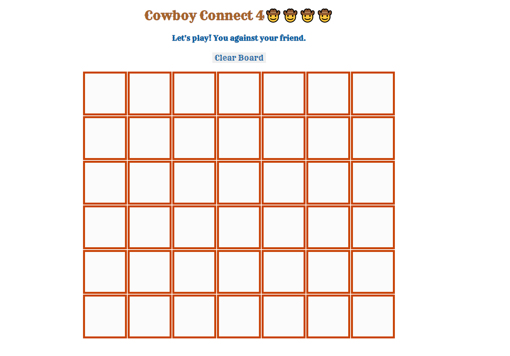

Hello y'all, Welcome to Connect 4!

List of the technologies used: JavaScript, HTML, CSS

Buckle up and grab a partner! YEEEEHAW!

Objective: 
You are trying to get 4 of your pieces touching. 
You need to watch where the other person is playing their pieces and strategically block them

This can be completed: 
  - hortizontally
  - vertically
  - diagonally

Getting Started:

1. Game always starts with 'Player1' being the lasso and 'Player2' being the cowboy hat.

2. Please click the top cell of each column to place your piece.

3. If the board is filled and there is no winner, then there is a tie.

4. Pressing the 'Clear Board' button will clear the board and have both players start over again.

Below will be some screenshots:

1. What the game looks like at the beginning 

2. During Play 

3. When there is a winner and where that message displays 

4. Where to find 'Clear Board' button 

Have Fun! DUELLLLLLLLL

